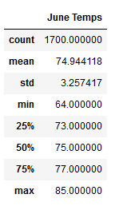
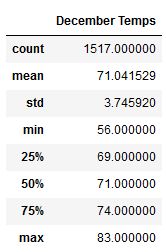
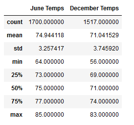
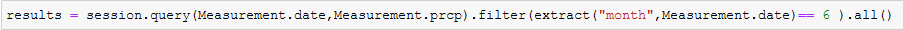
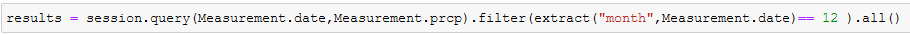
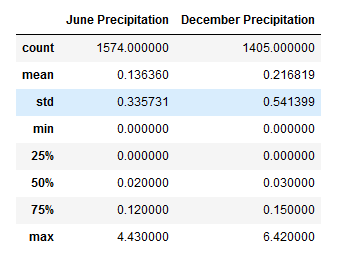

# Surfs Up Analysis
## Resources
pgAdmin 4 (Python: 3.8.3), PostgreSQL 12.7

## Overview
An analysis of weather data on Oahu in support of the opening of a surf and ice cream shop on that island.  In particular, the venture backer desires information on temperature statistics during the months of June and December.

## Results

[Fig1: June Temperatures](other_resources/01_June_Temperatures.png?raw=true “Figure 2: June Temperatures”)

[Fig2: December Temperatures](other_resources/02_December_Temperatures.png?raw=true “Figure 2: December Temperatures”)

[Fig3: December and JuneTemperatures](other_resources/03_June_and_December_Temperatures.png?raw=true “Figure 3: December Temperatures”)

Figure 3 combines Figures 1 and 2 for ease of comparison. 
- Median temperature between the two months is within one standard deviation at higher than 70 degrees.
- Minimum temperature for December is likely slightly too cold for ice cream, but the 25% at 69 degrees is fine, leaving 75% of outcomes as fine for ice cream sales.
- Mean temperatures also indicate that ice cream demand is expected to be reasonable

## Summary

[Fig4: June Precipitation Query](other_resources/04_June_Precipitation_Query.png?raw=true “Figure 4: June Precipitation Query”)

[Fig5: June Precipitation](other_resources/05_June_Precipitation.png?raw=true “Figure 5: June Precipitation”)

[Fig6: December Precipitation Query](other_resources/06_December_Precipitation_Query.png?raw=true “Figure 6: December Precipitation Query”)

[Fig7: December Precipitation](other_resources/07_December_Precipitation.png?raw=true “Figure 7: December Precipitation”)

[Fig8: December and JuneTemperatures](other_resources/08_June_and_December_Precipitation.png?raw=true “Figure 8: December Temperatures”)

Figures 4 and 6 present two additional queries that can be used for further analysis of this dataset: precipitation in June and December, comparable with the temperature analysis conducted.  Figure 7 summarizes the results, which in short indicate that there is de minimis precipitation in both months.  Even the maximum rainfall is small compared to mainland values.  This analysis should be conducted to rule out monsoon effects, both otherwise, both Temperature and precipitation analysis shows that the surf and ice cream shop should be a great investment.

